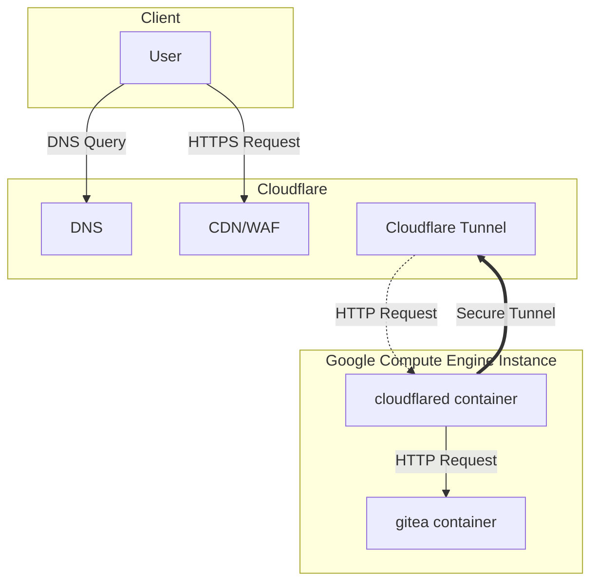

# Gitea IaC on GCP

This project automates the deployment and management of a Gitea service on Google Cloud Platform (GCP) using Terraform and Docker Compose. It emphasizes modularity, security, and automation.

## Architecture



---

## Terraform Cloud Integration

This project uses [Terraform Cloud](https://app.terraform.io/) for remote state management, collaboration, and automated runs. Key features include:

- **Remote State Storage**: Secure, team-accessible Terraform state.
- **VCS Integration**: Automatic runs triggered by repository changes.
- **Workspace Management**: Separate environments (e.g., staging, production) via workspaces.
- **Run Automation**: Plan/apply workflows, policy checks, notifications.

### Cloud Block & Environment Variables (Recommended)

To configure Terraform Cloud, add an empty `cloud` block in your `terraform` configuration (usually in `terraform/backend.tf` or `terraform/main.tf`):

```hcl
terraform {
  cloud {}
}
```

Then, set the following environment variables to control organization, hostname, project, and workspace selection:

- `TF_CLOUD_ORGANIZATION`: Specifies the Terraform Cloud organization name.
- `TF_CLOUD_HOSTNAME`: Specifies the hostname for Terraform Enterprise (optional, defaults to app.terraform.io).
- `TF_CLOUD_PROJECT`: Specifies the HCP Terraform project name.
- `TF_WORKSPACE`: Specifies the workspace name (must already exist).

Terraform will use these environment variables if the corresponding attributes are omitted from the cloud block. If both are set, the configuration file takes precedence.

**Example:**

```bash
export TF_CLOUD_ORGANIZATION=<your-org-name>
export TF_WORKSPACE=<your-workspace-name>
export TF_CLOUD_PROJECT=<your-project-name>
```

For more details, see the [Terraform block configuration reference](https://developer.hashicorp.com/terraform/language/terraform#environment-variables-for-the-cloud-block) and [Terraform Cloud documentation](https://developer.hashicorp.com/terraform/cloud-docs).

---

## Connecting to the Gitea Instance via IAP Tunnel

Use the following command to SSH into the Gitea VM through Google Cloud IAP tunneling:

```bash
SSH_USER=user
INSTANCE_NAME=
ZONE=us-west1-a
PROJECT_ID=
gcloud compute ssh ${SSH_USER}@${INSTANCE_NAME} --tunnel-through-iap \
  --zone=${ZONE} --project=${PROJECT_ID}
```

## Accessing the Docker Daemon on the Gitea Instance

To interact with the Docker daemon running on the Gitea instance, set up local port forwarding with:

```bash
SSH_USER=user
INSTANCE_NAME=
ZONE=us-west1-a
PROJECT_ID=
gcloud compute ssh ${SSH_USER}@${INSTANCE_NAME} --tunnel-through-iap \
  --zone=${ZONE} --project=${PROJECT_ID} \
  --ssh-flag='-qNf -L /tmp/docker.sock:/var/run/docker.sock'
```

After setting up the tunnel, you can run Docker commands against the remote Docker daemon using:

```bash
DOCKER_HOST=unix:///tmp/docker.sock docker info
```

---

## References

### Workload Identity Federation

- [GitHub - google-github-actions/auth: A GitHub Action for authenticating to Google Cloud.](https://github.com/google-github-actions/auth)
- [Configure Workload Identity Federation with deployment pipelines  |  IAM Documentation  |  Google Cloud](https://cloud.google.com/iam/docs/workload-identity-federation-with-deployment-pipelines#github-actions)
- [Principal identifiers  |  IAM Documentation  |  Google Cloud](https://cloud.google.com/iam/docs/principal-identifiers)

### Google Cloud IAP

- [Using IAP for TCP forwarding  |  Identity-Aware Proxy  |  Google Cloud](https://cloud.google.com/iap/docs/using-tcp-forwarding)
